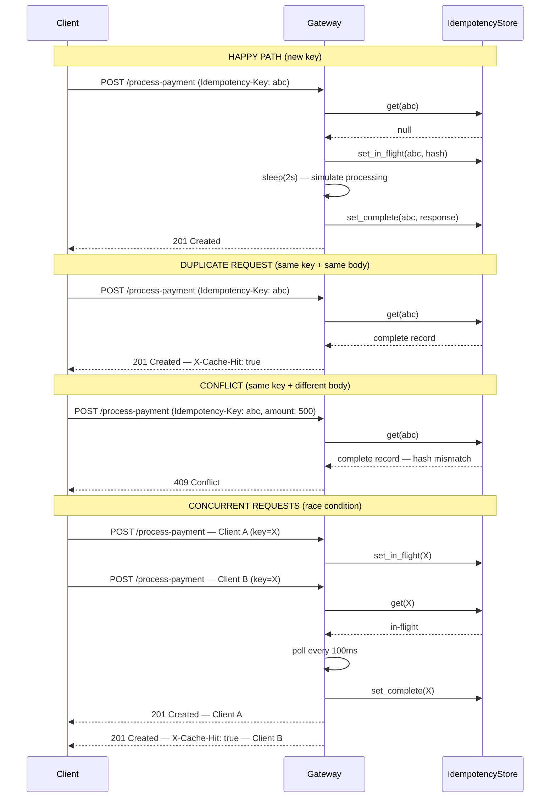

# Idempotency-Gateway: The "Pay-Once" Protocol

A production-grade Python/FastAPI service that ensures payment requests are processed **exactly once**, no matter how many times a client retries.

---

## Architecture Diagram




---

## Setup Instructions

### Prerequisites
- Python 3.11 or later
- `pip`

### 1. Clone the Repository

```bash
git clone https://github.com/NAPARI45/idempotency-gateway.git
cd idempotency-gateway
```

### 2. Create a Virtual Environment

```bash
python -m venv .venv
source .venv/bin/activate        # macOS / Linux
.venv\Scripts\activate           # Windows
```

### 3. Install Dependencies

```bash
pip install -r requirements.txt
```

### 4. Start the Server

```bash
uvicorn app.main:app --reload
```

The API is now live at `http://127.0.0.1:8000`.
Interactive docs: `http://127.0.0.1:8000/docs`

### 5. Run the Test Suite

```bash
pytest tests/ -v
```

---

## API Documentation

### `GET /health`

Quick liveness probe.

**Response `200 OK`**
```json
{ "status": "ok", "service": "idempotency-gateway" }
```

---

### `POST /process-payment`

Submit a payment for processing.

**Request Headers**

| Header            | Required | Description                                      |
|-------------------|----------|--------------------------------------------------|
| `Idempotency-Key` | Yes   | Client-generated UUID identifying this attempt  |
| `Content-Type`    | Yes   | `application/json`                               |

**Request Body**

```json
{
  "amount": 100,
  "currency": "GHS"
}
```

#### Scenario A — First Request (Happy Path)

```bash
curl -X POST http://localhost:8000/process-payment \
  -H "Content-Type: application/json" \
  -H "Idempotency-Key: a1b2c3d4-e5f6-7890-abcd-ef1234567890" \
  -d '{"amount": 100, "currency": "GHS"}'
```

**Response `201 Created`**
```json
{
  "message": "Charged 100 GHS",
  "idempotency_key": "a1b2c3d4-e5f6-7890-abcd-ef1234567890",
  "amount": 100,
  "currency": "GHS",
  "status": "success"
}
```

#### Scenario B — Duplicate Request

```bash
curl -X POST http://localhost:8000/process-payment \
  -H "Content-Type: application/json" \
  -H "Idempotency-Key: a1b2c3d4-e5f6-7890-abcd-ef1234567890" \
  -d '{"amount": 100, "currency": "GHS"}'
```
Response `201 Created`** with header `X-Cache-Hit: true`

#### Scenario C — Conflict

```bash
curl -X POST http://localhost:8000/process-payment \
  -H "Idempotency-Key: a1b2c3d4-e5f6-7890-abcd-ef1234567890" \
  -d '{"amount": 500, "currency": "GHS"}'
```

**Response `409 Conflict`**
```json
{ "detail": "Idempotency key already used for a different request body." }
```

---

## Design Decisions

### 1. `asyncio.Lock` per Key : Race Condition Safety
Each key gets its own lock created on-demand. A concurrent duplicate detects the `in-flight` state and polls every 100 ms rather than acquiring the lock, ensuring the payment logic runs exactly once.

### 2. SHA-256 Body Hashing
The request body is serialised with `sort_keys=True` before hashing, so key ordering differences across client implementations never cause false conflicts.

### 3. FastAPI `Depends()` for Store Injection
`get_store()` pulls the store from `app.state` via FastAPI's dependency injection system. Route handlers never touch `Request` directly, and tests can swap the store out with a single assignment.

---

## Developer's Choice : TTL-Based Key Expiry

The `IdempotencyStore` expires records after 1 hour (configurable). Every `get()` lazily evicts stale records; a background task sweeps the store every 5 minutes.

**Why it matters:**
- Prevents unbounded memory growth under high volume.
- Bounds the replay window : a leaked key cannot trigger a payment replay years later.
- Matches industry practice: Stripe expires keys after 24 hours.

---

## Project Structure

```
idempotency-gateway/
├── app/
│   ├──  routers/
│       ├── __init__.py
│       ├── meta.py          # GET /health
│       └── payments.py      # POST /process-payment — all idempotency logic
│   ├── __init__.py
│   ├── dependencies.py      # body_hash() utility + get_store() injector
│   ├── main.py              # App factory: creates instance, mounts routers, lifespan
│   ├── models.py            # Pydantic request / response models
│   └── store.py             # In-memory IdempotencyStore with TTL + locks
├── tests/
│   ├── __init__.py
│   └── test_gateway.py      # 10 async tests covering all user stories
├── pytest.ini
├── README.md  
└── requirements.txt
```

---

## Test Coverage Summary

| Test | Coverage |
|---|---|
| `test_first_request_returns_201` | Story 1 Happy Path |
| `test_first_request_no_cache_hit_header` | Story 1 Happy Path |
| `test_duplicate_returns_same_response` | Story 2 Idempotency |
| `test_duplicate_has_cache_hit_header` | Story 2 Idempotency |
| `test_conflict_on_different_body` | Story 3 Fraud/Error Check |
| `test_missing_idempotency_key_returns_422` | Validation |
| `test_invalid_amount_returns_422` | Validation |
| `test_concurrent_requests_processed_once` | Bonus Race Condition |
| `test_expired_key_is_reprocessed` | Developer's Choice TTL |
| `test_health_check` | Meta |


